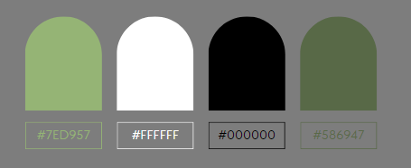

#Thème Minimaliste et Épuré

##Palette de Couleurs :

* **Fond** : Blanc immaculé pour mettre en valeur les fleurs et les arrangements.
* **Accent** : Utilisation de couleurs douces pour les éléments de navigation(rose pâle, vert clair).

##Design :

* **Images de Qualité** : Utilisation d'images de haute qualité pour les produits, les arrangements et les fleurs.
* **Mise en Page** : Design minimaliste avec beaucoup d'espace négatif pour permettre aux fleurs de briller. Utilisation de grilles pour présenter les produits de manière organisée.

##Typographie :

* **Polices** : Polices modernes et épurées pour une lisibilité optimale, sans distraire l'attention des images : **Diphylleia** 

https://fonts.google.com/specimen/Diphylleia?subset=latin&noto.script=Kore&preview.text=bonjour.

##Éléments interactifs :

* **Galerie Élégante** : Mise en place d'une galerie interactive avec des options de zoom pour admirer les détails des arrangements floraux.
* **Sélection Intuitive** : Système de sélection simple pour les différents types de fleurs ou d'arrangements, avec des filtres par couleur, occasion, etc.

##Ton et Style :

* **Focus sur la Qualité** : Mettre en avant la qualité des fleurs, des arrangements et du service client.
* **Élégance Discrète** : Utiliser des termes délicats pour décrire les fleurs et les arrangements, renforçant l'aspect sophistiqué de la marque.